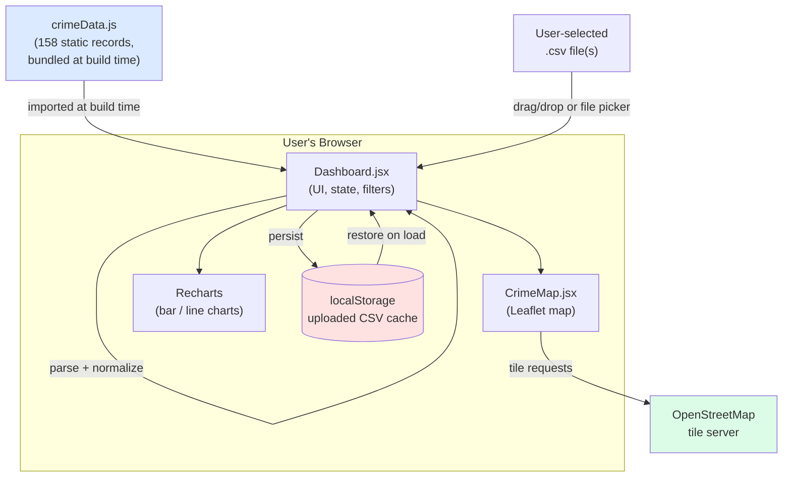
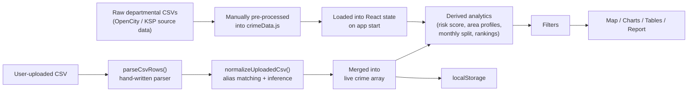
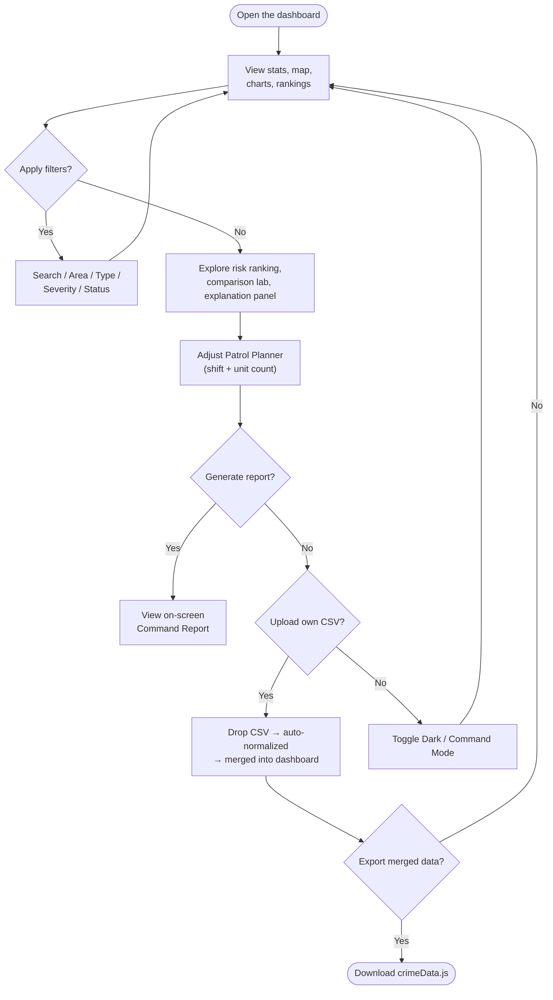
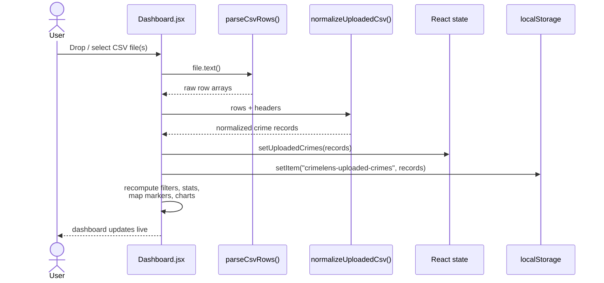

<div align="center">

# 🛡️ CrimeLens AI

### Explainable Crime Intelligence & Patrol-Planning Dashboard for Karnataka

*A frontend crime analytics command center — hotspot mapping, transparent risk scoring, and patrol planning, built on real Karnataka Police / OpenCity crime data.*


[**Live Demo**](https://crimelens-ai-catalyst.onslate.in) · [**Repository**](https://github.com/sneha200908/CrimeLens-AI) · [**Source Dataset**](https://data.opencity.in/organization/bengaluru-city-police)

</div>

---

> ⚠️ **Scope note (read this first).** This README documents *only what exists in the repository at the time of writing*. The codebase is a **single-page React + Vite frontend application** with a bundled static dataset. There is **no backend server, no database, no authentication layer, no REST API, and no Zoho Catalyst integration** anywhere in the source tree (`src/`, `public/`, config files). Every "AI" and "prediction" feature described below is **deterministic JavaScript logic** running entirely in the browser — not a trained ML model. Where the project's naming (the deployment subdomain includes the word "catalyst") might suggest a Zoho Catalyst backend, no such backend, function, or SDK call is present in this repository. Anything not implemented is explicitly marked **`Planned`** rather than described as shipped.

---

## 📚 Table of Contents

- [Executive Summary](#-executive-summary)
- [Problem Statement](#-problem-statement)
- [Existing Approaches & Where They Fall Short](#-existing-approaches--where-they-fall-short)
- [Why CrimeLens AI](#-why-crimelens-ai)
- [Key Features](#-key-features)
- [How the "AI" Actually Works](#-how-the-ai-actually-works)
- [Dataset](#-dataset)
- [System Architecture](#-system-architecture)
- [Data Flow](#-data-flow)
- [User Flow](#-user-flow)
- [In-App Interaction Sequence](#-in-app-interaction-sequence)
- [Technology Stack](#-technology-stack)
- [Zoho Catalyst — Status in This Repository](#-zoho-catalyst--status-in-this-repository)
- [Folder Structure](#-folder-structure)
- [Installation & Local Setup](#-installation--local-setup)
- [Deployment](#-deployment)
- [Data Interfaces (No REST API)](#-data-interfaces-no-rest-api)
- [Performance Notes](#-performance-notes)
- [Security Notes](#-security-notes)
- [Accessibility Notes](#-accessibility-notes)
- [Scalability — What Would Need to Change](#-scalability--what-would-need-to-change)
- [Screenshots](#-screenshots)
- [Roadmap](#-roadmap)
- [Challenges Faced](#-challenges-faced)
- [Learnings](#-learnings)
- [Team](#-team)
- [FAQ](#-faq)
- [Contributing](#-contributing)
- [License](#-license)
- [Acknowledgements](#-acknowledgements)
- [Contact](#-contact)

---

## 🧭 Executive Summary

**CrimeLens AI** is a hackathon-built, browser-based dashboard for exploring reported crime data across Karnataka. It takes CSV-derived crime records (sourced from the Bengaluru City Police / OpenCity open dataset and Karnataka Crime Review figures), bundles them as static JSON, and layers explainable scoring, mapping, filtering, and reporting on top — entirely client-side, with no server component.

**Who it's for:** the stated audience is police command staff, analysts, and control-room teams who want a single screen to spot high-activity areas, understand *why* an area is flagged, and get a starting point for patrol allocation — as a prototype, not a production policing tool.

**Why it exists:** built for a hackathon problem statement around AI-driven crime analytics and visualization, using publicly available Karnataka/Bengaluru police data as the substrate.

**What it solves (as a prototype):** replaces static spreadsheets/CSVs of crime counts with an interactive, filterable, mapped view, and adds a transparent (rule-based) risk score so every hotspot ranking comes with a human-readable justification rather than a black-box number.

**Impact framing:** the project's value case is faster situational awareness for non-technical command staff and a repeatable way to reason about "where would AI-style triage look?" — it does **not** claim statistically validated forecasting or law-enforcement-grade predictive policing accuracy.

---

## ❗ Problem Statement

The hackathon problem statement is **"AI-Driven Crime Analytics & Visualization Platform."** The pain points this project is scoped against:

- Crime data published by government/open-data portals (like OpenCity's Bengaluru City Police organization page) typically arrives as **raw tabular CSVs** — hard to explore without spreadsheet skills.
- Manual analysis of crime trends across dozens of districts/divisions and dozens of offence categories is slow and error-prone.
- Existing dashboards for this kind of data are often static reports (PDFs, printed tables) rather than interactive, filterable tools.
- There's rarely a transparent way to say *why* one area is prioritized over another — scores, if they exist, are opaque.
- Decision-makers need a translation layer from "raw numbers" to "where should we send patrols this shift" — and that layer is usually done manually.

---

## 🔍 Existing Approaches & Where They Fall Short

| Approach | Typical Shortcoming |
|---|---|
| Static government CSV/PDF crime reports | No filtering, no visualization, hard to cross-reference by area/category/time |
| Generic BI dashboards (Power BI/Tableau exports) | Require licensed tooling, not tailored to policing workflows (patrol windows, severity, case status) |
| Opaque "AI risk score" tools | Score with no visible reasoning — hard for an officer to trust or challenge |
| Spreadsheet-based manual triage | Doesn't scale across dozens of areas/categories, no map, no live filtering |

**CrimeLens AI's positioning against these:** it's a lightweight, dependency-light frontend that ingests the same kind of CSV data these approaches already use, but adds interactive filtering, a mapped view, and — critically — an **explainable** scoring method where every risk number is broken down into the inputs that produced it (see [How the "AI" Actually Works](#-how-the-ai-actually-works)).

---

## ✅ Why CrimeLens AI

- **Explainability over black-box scoring.** The risk engine's inputs (crime volume, severity, case status, time-of-day) are visible in the UI, not hidden.
- **Bring-your-own-data.** The built-in CSV Data Pipeline lets a user upload their own CSVs and have them heuristically mapped into the same schema as the bundled dataset — no backend required.
- **Zero infrastructure.** Runs entirely as static files (Vite build output) — no server, database, or API keys to provision for the current feature set.
- **Fast to reason about.** A single dashboard screen (no multi-page navigation to get lost in) surfaces stats, map, charts, rankings, and a generated report together.

---

## 🧩 Key Features

Every feature below is implemented in `src/components/Dashboard.jsx` and `src/components/CrimeMap.jsx` and is verifiable in the current codebase.

### 1. Command Stats Strip
- **Purpose:** at-a-glance totals for the currently filtered dataset.
- **Workflow:** four stat cards — Total Crimes, High Severity Crimes, AI Risk Score (average), Clearance Rate — recompute live as filters change.
- **Implementation:** derived with `reduce`/`filter` over the filtered crime array; `Intl.NumberFormat("en-IN")` used for Indian-style number grouping.
- **User impact:** immediate top-line read on the current view without opening a chart.

### 2. Smart Filters
- **Purpose:** narrow the dataset by free-text search plus four dropdowns.
- **Workflow:** a text search box (matches area, crime type, or district) alongside **Area**, **Crime Type**, **Severity**, and **Status** selects. Options are generated dynamically from the live dataset (`new Set(...)` over current records), so uploaded CSV data automatically appears in the dropdowns.
- **Technical implementation:** a single `filters` state object; `filteredCrimes` is a `useMemo` derived from `filters` + `intelligenceCrimes`.
- **User impact:** every other panel on the page (map, charts, tables, report) reacts to this one filter state.

### 3. Crime Hotspot Map
- **Purpose:** geographic view of crime records.
- **Workflow:** a Leaflet map (via `react-leaflet`) centered on Karnataka (12.9716, 77.5946), rendering one `CircleMarker` per filtered record.
- **Implementation:** marker color and radius are driven by the computed risk score (`getRiskColor`, `getMarkerRadius`); each marker has a popup showing area, category, total crimes, severity, AI risk, and suggested patrol window. A four-tier legend (Critical/High/Moderate/Watch) is rendered alongside.
- **User impact:** visual triage — bigger, redder circles are the areas the app is flagging as higher priority.

### 4. Area Risk Ranking
- **Purpose:** ranked list of the top 5 highest-risk areas in the current filter.
- **Implementation:** `getAreaProfiles()` groups records by area, computes an average risk score per area, and sorts descending.

### 5. District Comparison Lab
- **Purpose:** side-by-side comparison of any two areas.
- **Workflow:** two dropdowns (Area A / Area B, defaulting to "Bengaluru City" vs. "Karnataka State") produce a comparison card with risk score, total crimes, active/unresolved cases, and dominant category for each.

### 6. AI Risk Explanation Panel
- **Purpose:** explainability — shows *why* the top-ranked hotspot got its score.
- **Implementation:** a `reasons[]` array is generated per area (e.g. "X total reported crimes," "Y pending or active-investigation crimes," "Z is the dominant crime category," plus a high-severity note when applicable), paired with a plain-language recommendation string.

### 7. Patrol Route Planner
- **Purpose:** turn the risk ranking into a shift-wise deployment suggestion.
- **Workflow:** user selects a **Shift** (Morning/Evening/Night) and a **Patrol Units** count (2–5); the app lists that many top-risk areas as "Unit N" assignments with a patrol time window and category watchlist.
- **Implementation:** `getPatrolWindow()` maps a record's time-of-day into one of three fixed windows (7 PM–11 PM / 2 PM–6 PM / 8 AM–12 PM) based on the hour extracted from the record's `time` field.

### 8. Emergency Resource Allocation
- **Purpose:** a headline "response level" card (e.g. *Critical Response*) with a suggested patrol-unit and investigator count.
- **Implementation:** `getEmergencyPlan()` adds extra units/investigators on top of the user-selected patrol-unit count when the top area's risk score or unresolved-case volume crosses fixed thresholds.

### 9. Next Month Prediction
- **Purpose:** a simple forward projection of case volume.
- **Implementation:** `getPrediction()` takes the last two points of a **synthetically generated** monthly split (see caveat below) and extrapolates the recent month-over-month growth at 80% continuation — a naive trend-continuation heuristic, not a statistical/ML time-series model.
- **⚠️ Caveat:** the "monthly" data feeding this chart (`getMonthlyData()`) is **not real monthly data** — it splits the filtered dataset's total using seven **fixed percentage weights** (10%, 11%, 12%, 13%, 15%, 18%, 21%) to synthesize a Jan–Jul curve. This is clearly a placeholder/illustrative mechanism, not month-level ground truth from the dataset.

### 10. Solved vs. Pending / Clearance Rate
- **Purpose:** shows the proportion of filtered cases marked `"Solved"` vs. `Pending`/`Under Investigation`.
- **Implementation:** a percentage bar computed from `status` field aggregation.

### 11. Command Report Generator
- **Purpose:** one-click, on-screen "report" summarizing the current filtered view.
- **Workflow:** a "Generate Command Report" toggle reveals a report block with primary hotspot, risk level, dominant category, active case load, clearance rate, an executive-action sentence, and the top-5 risk ranking list.
- **⚠️ Caveat:** this is an **on-screen summary panel**, not an exported file (no PDF/CSV/print export is implemented for this specific panel).

### 12. Monthly Crime Projection Chart
- Line chart (Recharts) of the synthetic monthly split described above, with an overlay-free single series.

### 13. Crime Categories Chart
- Horizontal bar chart of the top 8 `categoryGroup` values by total crime count.

### 14. Area-wise Crime Count Chart
- Vertical bar chart of the top 10 areas by total crime count, with rotated axis labels for readability.

### 15. Patrol Recommendation Text Block
- A small set of templated recommendation sentences (top area/window/category are interpolated in; the rest are fixed operational-suggestion copy) — a light "explain the dashboard" affordance rather than a dynamic recommendation engine.

### 16. CSV Data Pipeline (Upload → Normalize → Merge → Export)
- **Purpose:** let a user bring their own crime CSVs into the dashboard without touching code.
- **Workflow:** drag-and-drop or file-picker upload of one or more `.csv` files → client-side parsing → heuristic column-mapping (see below) → merged into the live dataset → optional **Export** button downloads the merged result as a ready-to-use `crimeData.js` file → **Clear Uploaded Data** button to reset.
- **Implementation details:**
  - A **hand-written CSV parser** (`parseCsvRows`) handles quoted fields and commas-in-quotes without any external CSV library.
  - `normalizeUploadedCsv()` uses **alias-based header matching** (`readField` tries a list of possible header spellings — e.g. `crimeType`, `category`, `type of crime`, `offence`, `offense`) plus **fallback inference** (`inferTextField`, `inferNumericField`) when no known header matches, so moderately messy CSVs can still be ingested.
  - Missing fields are backfilled with sensible defaults (synthetic incrementing coordinates near Bengaluru if lat/long are absent, a default time of `19:30`, an inferred severity/status from volume and category keywords).
  - Uploaded data is persisted via **`window.localStorage`** (key: `crimelens-uploaded-crimes`) so it survives a page refresh — this is the app's only persistence layer; there is no server-side storage.
  - Four live metrics (uploaded total crimes, high-severity count, average AI risk, clearance rate) update as soon as a file is processed.
- **User impact:** this is the closest thing the app has to a real "data pipeline" — it's genuinely functional, entirely in-browser, and reasonably resilient to inconsistent column names.

### 17. High-Priority Case Queue
- A sortable-by-risk table of the top 7 records (Record ID, Category, Area/Unit, Total Crimes, Risk badge, Status, and a suggested action — "Fast-track review" or "Monitor trend").

### 18. Command Mode (Dark Mode)
- A theme toggle that swaps a `dark-mode` class across the app shell; dark-mode-specific styling is defined for the hero, stat cards, panels, and report sections in `src/index.css`.

### 19. AI Insights & System Capabilities Sections
- Two static, marketing-style informational sections at the bottom of the dashboard describing the risk engine, shift deployment logic, and four "system capability" blurbs (Predictive Hotspot Detection, Explainable AI Scoring, Patrol Planning Support, Decision-ready Reports). These are **descriptive copy**, not interactive components.

---

## 🤖 How the "AI" Actually Works

There is no machine-learning model, no training pipeline, and no external AI/LLM API call in this repository. "AI" in this project refers to a **transparent, rule-based scoring system** written in plain JavaScript inside `Dashboard.jsx`:

```
riskScore = min(100,
    volumeScore                         // up to 42 pts, scaled by (record's totalCrimes / max totalCrimes in dataset)
  + severityScore(severity)             // High=28, Medium=17, Low=8
  + statusScore(status)                 // Under Investigation=16, Pending=13, Solved=4
  + nightScore(time)                    // 18:00–05:59 = 14, 12:00–17:59 = 7, else = 3
)
```

The resulting 0–100 score is bucketed into a risk level:

| Score range | Risk Level |
|---|---|
| 80–100 | Critical |
| 62–79 | High |
| 42–61 | Moderate |
| 0–41 | Watch |

This same formula powers the map marker coloring/sizing, the area risk ranking, the patrol planner, the emergency allocation card, and the priority case queue — it is the single scoring mechanism behind every "AI" label in the UI. Framing it accurately as **explainable heuristic scoring** (not predictive ML) is a deliberate part of the project's pitch: an officer can see exactly which four factors produced any given number.

**Future AI scope (not yet implemented):** a real trained model (e.g. time-series forecasting on actual monthly/weekly granularity, or a classifier for likely offence escalation) is a natural next step — see [Roadmap](#-roadmap).

---

## 🗂️ Dataset

- **Source:** [OpenCity's Bengaluru City Police organization page](https://data.opencity.in/organization/bengaluru-city-police), combined with Karnataka Crime Review aggregate figures.
- **Format shipped in the repo:** a single static file, `src/data/crimeData.js`, exporting a `crimeData` array — **no live API call, no database, no build-time fetch**. The data is baked into the frontend bundle.
- **Volume:** **158 records** across **29 distinct areas** (Bengaluru City, Bengaluru District, Bengaluru South, Tumakuru, Mysuru District, Shivamogga, Bidar, Hassan, Chikkamagaluru, Chitradurga, Davanagere, Haveri, Kalaburagi, Mandya, Uttara Kannada, Vijayapur, Bagalkot, Belagavi District, Chickballapura, plus Bengaluru City police divisions — CENTRAL, EAST, NORTH, NORTH EAST, SOUTH, SOUTH EAST, WEST, WHITEFIELD, CYBER PS/COP — and a statewide `"Karnataka State"` aggregate row).
- **Crime categories:** ~40 distinct offence labels spanning IPC/BNS crimes, crimes against women (Sec. 498(A), 354, 376, 509 IPC, Dowry Prohibition Act, Immoral Trafficking Act), crimes against children (POCSO Act, Juvenile Justice Act, Child Labour Act, Child Marriage Restraint Act, ss. 317/318 IPC), cyber crime, property crimes (theft, burglary, chain snatching, motor vehicle theft), violent crimes (murder, attempt to murder, dacoity, robbery), suicides & accidental deaths (by cause), and SLL crimes — each rolled up into 9 broader **category groups** via `getCategoryGroup()` keyword matching.
- **Fields per record:** `caseId`, `crimeType`, `categoryGroup`, `district`, `area`, `date`, `time`, `latitude`, `longitude`, `severity`, `status`, `totalCrimes`, `detectedCrimes`, `underInvestigation`, `ipcBnsCrimes`, `sllCrimes`, `source`.
- **Status values:** `Solved`, `Pending`, `Under Investigation`.
- **Severity values:** `High`, `Medium`, `Low`.
- **Source attribution embedded per record:** strings like `"Crimes Against Women CSV 2021/2022/2023"`, `"Cyber Crime Division CSV 2021/2022/2023"`, `"Major IPC Crimes CSV 2021/2022/2023"`, `"Suicides and Accidental Deaths CSV 2021/2022/2023"`, and `"Karnataka Crime Review 2025 / OpenCity BCP CSV"` — indicating the bundled data was assembled from several yearly departmental CSVs.
- **Cleaning / feature engineering actually performed (evidenced in code):**
  - Category grouping via keyword matching (`getCategoryGroup`).
  - Coordinates attached per area for mapping.
  - `riskScore` / `riskLevel` / `patrolWindow` are **derived at render time**, not stored in the raw file.
- **User-supplied data:** the CSV upload pipeline (Feature 16 above) performs the equivalent cleaning/normalization/feature-engineering steps on any CSV a user drops in, using header-alias matching and inferred defaults — this is the project's live "raw data → insight" pipeline in action.
- **Missing-value handling:** default values are substituted for absent latitude/longitude, time, severity, and status when ingesting uploaded CSVs (see Feature 16); the bundled dataset itself has no visible null/blank handling since it ships pre-cleaned.

---

## 🏗️ System Architecture



There is no application server, no API gateway, and no database tier — the entire system lives inside the static bundle produced by `vite build`, served from a static host.

---

## 🔄 Data Flow



---

## 🧑‍💻 User Flow



---

## 🔁 In-App Interaction Sequence

There is no client–server request in this app; the sequence below shows the actual in-browser interaction chain for the CSV upload feature, which is the closest thing to a "request flow" that exists.



---

## 🧰 Technology Stack

### Frontend

| Library | Version (per `package.json`) | Purpose |
|---|---|---|
| React | ^19.2.7 | UI rendering |
| React DOM | ^19.2.7 | DOM rendering target |
| Vite | ^8.1.1 | Dev server & build tool |
| @vitejs/plugin-react | ^6.0.3 | React fast-refresh/JSX support in Vite |
| Recharts | ^3.10.0 | Bar & line charts |
| Leaflet | ^1.9.4 | Map rendering engine |
| react-leaflet | ^5.0.0 | React bindings for Leaflet |
| lucide-react | ^1.26.0 | Icon set used throughout the dashboard |

### Tooling

| Tool | Purpose |
|---|---|
| ESLint (+ `eslint-plugin-react-hooks`, `eslint-plugin-react-refresh`) | Linting |
| `@types/react`, `@types/react-dom` | Editor type support (project itself is plain JSX, not TypeScript) |

### Backend / Database / AI / Cloud

| Layer | Status |
|---|---|
| Backend server | ❌ Not present |
| Database | ❌ Not present (browser `localStorage` only, for uploaded CSVs) |
| Authentication | ❌ Not present |
| REST/GraphQL API | ❌ Not present |
| Machine learning model | ❌ Not present (rule-based scoring only) |
| Zoho Catalyst | ❌ Not present in code — see next section |

> Note: `package-lock.json` contains an entry for `@reduxjs/toolkit` as a transitive dependency, but it is **not imported anywhere in `src/`** — the app's entire state management is native React `useState`/`useMemo`/`useRef`.

---

## ☁️ Zoho Catalyst — Status in This Repository

The deployment URL for this project (`crimelens-ai-catalyst.onslate.in`) includes the word "catalyst," and the hackathon context implies a Zoho Catalyst-based build. However, **a full read of the repository found no Catalyst SDK, no `catalyst.config.json` / Catalyst CLI configuration, no Catalyst functions folder, and no `@zohocatalyst`/`zcatalyst` package** in `package.json`, `package-lock.json`, or anywhere in `src/`.

**Honest status:** Catalyst integration is either handled entirely outside this repository (e.g. purely for static hosting of the Vite build output, with no app-level SDK usage), or is **planned but not yet committed**. This README does not describe specific Catalyst services (Functions, Data Store, Authentication, etc.) because none are implemented in the current codebase — doing so would be inventing detail not present in the project.

---

## 📁 Folder Structure

```
CrimeLens-AI/
├── public/
│   ├── favicon.svg          # App favicon
│   └── icons.svg            # Icon sprite sheet
├── src/
│   ├── assets/
│   │   ├── hero.png         # Hero/branding image asset
│   │   ├── react.svg        # Vite template asset
│   │   └── vite.svg         # Vite template asset
│   ├── components/
│   │   ├── Dashboard.jsx    # Entire dashboard: state, filters, scoring,
│   │   │                    # charts, map wiring, CSV pipeline, report panel
│   │   └── CrimeMap.jsx     # Leaflet map + risk-colored markers + legend
│   ├── data/
│   │   └── crimeData.js     # 158 static crime records (bundled dataset)
│   ├── App.jsx               # Root component — renders <Dashboard />
│   ├── App.css                # Component-scoped styling
│   ├── index.css              # Global styling, layout, dark mode, responsive rules
│   └── main.jsx                # React root mount (StrictMode)
├── index.html                   # Single HTML entry point (Vite SPA shell)
├── vite.config.js               # Vite + React plugin config (minimal, default)
├── eslint.config.js             # ESLint rules
├── package.json / package-lock.json
└── README.md
```

There is intentionally no `api/`, `server/`, `controllers/`, `services/`, `models/`, `middleware/`, `.env`, or `auth/` directory in this repository.

---

## 🛠️ Installation & Local Setup

### Prerequisites
- Node.js (a recent LTS version compatible with Vite 8 / React 19)
- npm (ships with Node.js)

### Steps

```bash
# 1. Clone the repository
git clone https://github.com/sneha200908/CrimeLens-AI.git
cd CrimeLens-AI

# 2. Install dependencies
npm install

# 3. Run the dev server
npm run dev

# 4. Build for production
npm run build

# 5. Preview the production build locally
npm run preview

# 6. Lint the codebase
npm run lint
```

### Environment Variables
None. There are no `.env` files, no `import.meta.env` usage, and no API keys required to run this project — it works entirely offline aside from the Leaflet tile-layer requests to OpenStreetMap.

---

## 🚀 Deployment

The `npm run build` command produces a static `dist/` folder (standard Vite output) that can be served by any static file host. The live deployment is published at **https://crimelens-ai-catalyst.onslate.in**. No server-side deployment steps (migrations, environment provisioning, secrets) are required or present for the current feature set, since the app has no backend dependency.

---

## 🔌 Data Interfaces (No REST API)

This project does not expose or consume a REST/GraphQL API. Its two data interfaces are:

| Interface | Direction | Mechanism |
|---|---|---|
| Bundled dataset | In | Static `import { crimeData } from "../data/crimeData"` at build time |
| CSV upload | In | Browser `File` API → client-side parsing, no network call |
| CSV export | Out | Client-generated `Blob` download of merged JSON as `crimeData.js` |
| Map tiles | Out | Direct ``-style tile requests to `https://{s}.tile.openstreetmap.org/{z}/{x}/{y}.png` |
| Uploaded-data persistence | In/Out | Browser `localStorage`, key `crimelens-uploaded-crimes` |

---

## ⚡ Performance Notes

Verified from the codebase:
- Expensive derivations (`filteredCrimes`, `intelligenceCrimes`) are wrapped in `useMemo` to avoid recomputation on unrelated re-renders.
- Chart components use Recharts' `ResponsiveContainer` for fluid resizing instead of fixed pixel dimensions.
- The map disables `scrollWheelZoom` by default, likely to avoid accidental zoom-trapping while scrolling the page.

Not present in the current codebase (would be future work, not existing features): code-splitting/lazy-loaded routes (there's only one route/component to begin with), image optimization pipeline, service worker/caching layer, or bundle-size analysis tooling.

---

## 🔒 Security Notes

Because there is no backend, classic API/auth attack surface (JWT handling, SQL injection, session fixation) doesn't apply to this codebase as it stands. What *is* relevant:
- **No authentication or authorization exists** — the dashboard is fully public to anyone with the URL; there is no concept of a logged-in user or restricted data.
- **CSV upload is client-side only** — files never leave the browser, which limits server-side attack surface but means there's no validation beyond the app's own parsing logic; malformed CSVs are handled with a try/catch that falls back to a status message rather than crashing.
- **`localStorage` is unencrypted** browser storage — uploaded crime data persists in plain form in the user's browser profile.
- **Third-party requests** are limited to OpenStreetMap tile fetches (no API key, no user data transmitted).

---

## ♿ Accessibility Notes

Verified from the codebase:
- Interactive elements use semantic `<button>`/`<select>`/`<input>` elements rather than non-semantic `<div>`s in most places.
- The CSV dropzone implements `role="button"`, `tabIndex={0}`, and an `onKeyDown` handler (`Enter`/`Space`) so it's keyboard-operable, not just mouse/drag-and-drop only.
- `:focus-visible` outline styling is defined in `App.css` for at least the counter/interactive elements shown there.

Not verified/likely gaps (should be checked, not claimed as done): comprehensive ARIA labeling on chart SVGs (Recharts' default accessibility support is limited), color-only risk-level differentiation on the map (severity/risk is conveyed primarily through color, which may need a non-color cue for colorblind users beyond the existing text legend).

---

## 📈 Scalability — What Would Need to Change

Being transparent about the current single-file, in-browser dataset model, scaling this beyond a prototype would require (none of this exists yet — listed as **Planned**):
- Moving `crimeData.js` to an actual backend/database so the dataset isn't rebuilt into the JS bundle on every update.
- A real ingestion API for CSV uploads (currently entirely client-side and per-browser via `localStorage`, so uploaded data is neither shared across users nor durable beyond one browser).
- Pagination/virtualization if the dataset grows well beyond ~150–200 records, since all filtering/mapping currently runs over the full in-memory array on every render.
- If Zoho Catalyst is intended as the backend, its Data Store, Functions, and Authentication services would be the natural home for the above — but none of that wiring exists in this repo today.

---

## 🖼️ Screenshots

*(Add screenshots here — see the "Screenshots to include" list in the accompanying presentation notes for exactly which dashboard states to capture.)*

| Section | Placeholder |
|---|---|
| Landing / Hero + Stats Strip | `docs/screenshots/hero-stats.png` |
| Crime Hotspot Map | `docs/screenshots/map.png` |
| Smart Filters in use | `docs/screenshots/filters.png` |
| Area Risk Ranking + AI Risk Explanation | `docs/screenshots/risk-explanation.png` |
| District Comparison Lab | `docs/screenshots/comparison-lab.png` |
| Patrol Route Planner | `docs/screenshots/patrol-planner.png` |
| Monthly Projection + Category charts | `docs/screenshots/charts.png` |
| CSV Data Pipeline (upload) | `docs/screenshots/csv-pipeline.png` |
| High Priority Case Queue | `docs/screenshots/case-queue.png` |
| Command Report panel | `docs/screenshots/command-report.png` |
| Dark / Command Mode | `docs/screenshots/dark-mode.png` |

---

## 🗺️ Roadmap

| Phase | Item | Status |
|---|---|---|
| Now | Rule-based explainable risk scoring | ✅ Shipped |
| Now | CSV upload → normalize → merge → export pipeline | ✅ Shipped |
| Now | Hotspot map, filters, comparison lab, patrol planner | ✅ Shipped |
| Next | Backend/database for shared (not per-browser) uploaded data | 🔜 Planned |
| Next | Real time-series data (actual monthly/weekly granularity) replacing the synthetic percentage-split chart | 🔜 Planned |
| Next | Trained forecasting model for the "Next Month Prediction" feature | 🔜 Planned |
| Later | Authentication / role-based access (officer vs. analyst vs. admin) | 🔜 Planned |
| Later | Exportable PDF/CSV command reports (current report is on-screen only) | 🔜 Planned |
| Later | Zoho Catalyst backend wiring (Data Store, Functions, Auth) if adopted | 🔜 Planned |

---

## 🧗 Challenges Faced

Framed honestly around what the codebase itself reveals as non-trivial work:
- **Heterogeneous CSV schemas:** Karnataka's departmental crime CSVs (women's crimes, children's crimes, cyber crimes, IPC/BNS crimes, suicides/accidental deaths) don't share one column layout — the alias-matching and inference logic in `normalizeUploadedCsv()`/`readField()`/`inferTextField()`/`inferNumericField()` exists specifically to reconcile that.
- **Designing an explainable score from arbitrary CSV input:** because uploaded data can be missing fields (coordinates, time, severity), the app had to define reasonable defaults (e.g. synthetic coordinates, a default evening time, keyword-based severity inference) so the risk engine still produces a sensible score.
- **Client-side-only persistence:** without a backend, `localStorage` was the only option for surviving a page refresh — which caps the amount and shareability of user-uploaded data.

---

## 🎓 Learnings

- A transparent, formula-based scoring system can be a legitimate and *more trustworthy* substitute for a black-box model in a domain (policing) where explainability directly affects whether a human will act on a recommendation.
- A well-designed client-side CSV pipeline (custom parser + alias matching + inferred defaults) can go a long way before a backend becomes strictly necessary for a prototype.

---

## 👥 Team

*(Not specified in the repository — add contributor names/roles here.)*

---

## ❓ FAQ

**1. Is this connected to a real police database?**
No — it uses a static, pre-processed dataset bundled into the app from public OpenCity/Karnataka Crime Review sources.

**2. Is the "AI" a machine learning model?**
No — it's a deterministic weighted-formula risk score computed in plain JavaScript. See [How the "AI" Actually Works](#-how-the-ai-actually-works).

**3. Does the app have a backend?**
No. It's a static frontend; there is no server, database, or API in this repository.

**4. Is Zoho Catalyst used?**
Not in the current codebase — no Catalyst SDK or config was found. See the dedicated section above.

**5. Can I upload my own crime data?**
Yes — the CSV Data Pipeline panel accepts `.csv` files, normalizes them, and merges them into the live dashboard.

**6. Where does uploaded CSV data get stored?**
In the browser's `localStorage`, under the key `crimelens-uploaded-crimes`. It is not sent to a server.

**7. Will my uploaded data be visible to other users?**
No — `localStorage` is per-browser, so uploaded data is local to your own device/browser only.

**8. Can I export the merged dataset?**
Yes — the "Export" button in the CSV Data Pipeline panel downloads a `crimeData.js`-formatted file of the merged (bundled + uploaded) records.

**9. Is there authentication or user accounts?**
No — the dashboard is fully public with no login.

**10. Is the "Next Month Prediction" statistically validated?**
No — it's a simple trend-continuation of a synthetically split monthly dataset, described transparently as illustrative in this README.

**11. What map library is used?**
Leaflet, via `react-leaflet`, with OpenStreetMap tiles.

**12. What charting library is used?**
Recharts, for the bar and line charts.

**13. How many crime records ship with the app by default?**
158 records across 29 areas.

**14. What time range does the bundled dataset cover?**
Records reference years 2021–2025 across their `source` fields (e.g. yearly departmental CSVs from 2021–2023, plus a 2025 Karnataka Crime Review row).

**15. Does the app support dark mode?**
Yes — a "Command Mode" toggle switches a dark theme across the dashboard.

**16. Is the dashboard responsive on mobile?**
The CSS defines breakpoints at 1024px, 960px, and 560px for layout adjustments; full mobile QA should still be performed before relying on this for a mobile audience.

**17. What happens if my uploaded CSV has unexpected column names?**
The alias-matching and inference logic (`readField`, `inferTextField`, `inferNumericField`) attempts to guess the right columns; rows with no usable numeric total are skipped.

**18. Can I filter by multiple areas at once?**
No — the current filter UI supports one area, one crime type, one severity, and one status selection at a time, plus free-text search.

**19. Is there a REST API I can call directly?**
No — there is no API surface in this repository.

**20. What license is this project under?**
Not specified in the repository at the time of writing — see [License](#-license).

**21. Is this production-ready for actual police deployment?**
No — it is explicitly described in-app as a "KSP Hackathon Prototype," intended as a demonstration/proof of concept.

**22. Where can I see the live version?**
https://crimelens-ai-catalyst.onslate.in

---

## 🤝 Contributing

No `CONTRIBUTING.md` or contribution guidelines currently exist in the repository. Suggested baseline for future contributors:
1. Fork the repo and create a feature branch.
2. Run `npm run lint` before opening a pull request.
3. Describe any dataset or scoring-formula changes clearly, since they affect the explainability the project is built around.

---

## 📄 License

No license file is currently present in this repository. Until one is added, all rights are reserved by the repository owner by default.

---

## 🙏 Acknowledgements

- Dataset: [OpenCity — Bengaluru City Police organization](https://data.opencity.in/organization/bengaluru-city-police)
- Mapping: [Leaflet](https://leafletjs.com/) and [OpenStreetMap](https://www.openstreetmap.org/) contributors
- Charting: [Recharts](https://recharts.org/)
- Icons: [Lucide](https://lucide.dev/)
- Built for a hackathon around the problem statement: *AI-Driven Crime Analytics & Visualization Platform*

---

## 📬 Contact

*(Not specified in the repository — add maintainer contact details here.)*
